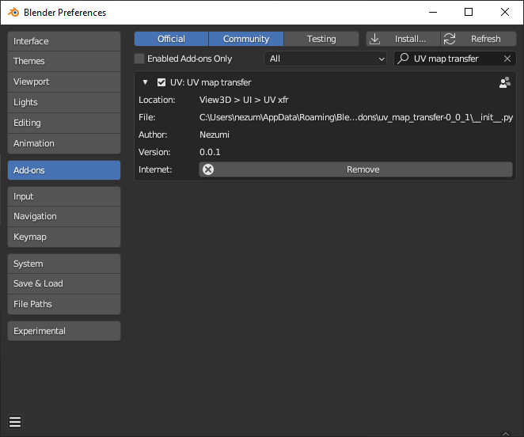
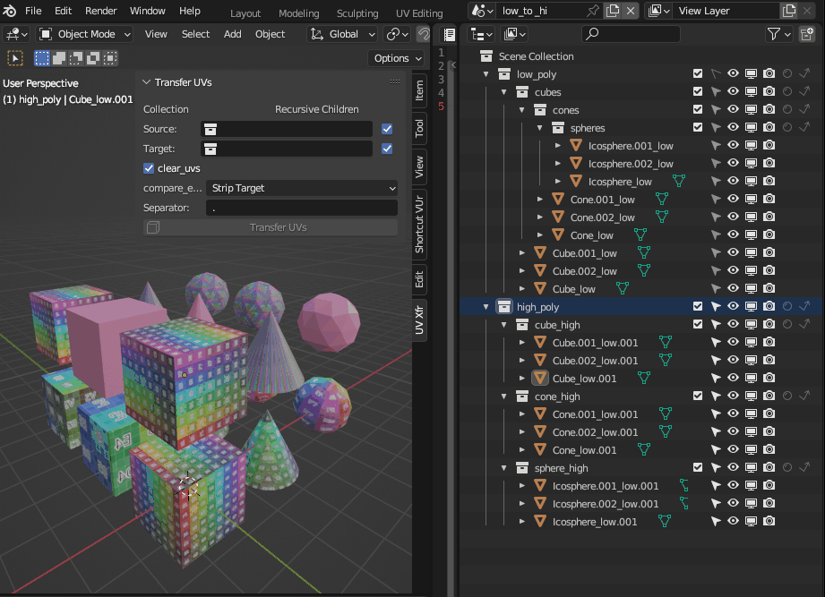
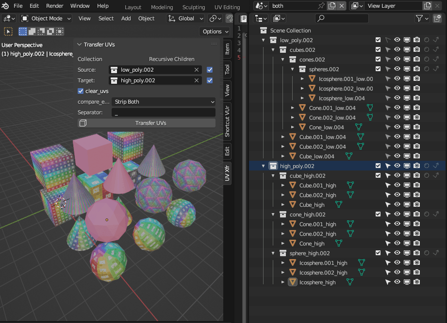

# UV Map Transfer

Simple UI to copy UV Maps between objects with matching naming conventions.

## Contents

1. [Installation](#installation)
2. [Panel layout](#panel-layout)
3. [Options](#options)
4. [Change Log](#change-log)

## Installation

](images/Installation_download.png)

* Download latest release.
* Save .zip file.

* Edit > Preferences > Add-ons
* Install
* Browse to saved file and install add-on
* Use check box to enable addon.

[Back to Contents](#contents)

## Panel layout

Source and target collections are filtered to collections of the current scene. You can select fom the drop down or drag a collection from the outliner into the fields.

The source collection should contain the objects you wish to copy UV maps from and the target collection should contain objects you wish to copy the UV maps to.
Enabling the checkbox to the right of the selected collection will select all objects in child, grandchild, etc sub collections.

The Clear Target UV Maps checkbox will force deletion of all UV Maps on target objects.

The Compare Type selection identifies how naming should be matched.

### Strip Target

* The source object name 'Cube' will be matched to a target object 'Cube.001' by splitting the target objects name with the user defined `Separator` and comparing the initial portions. This will also match a source object named 'Sphere.L' to a target object named 'Sphere.L.999' since only the last portion of the name is stripped.

### Strip Source

* Operates in the same way as Strip Target simply inverting which object names should be stripped of characters after `Separator`.

### Strip Both

* Removes the last portion of the object names from the source and target collections allowing naming convention of 'Cone.low' to be matched to 'Cone.high' again stripping only characters from the last instance of the `Separator` on each objects name to provide comparison.

[Back to Contents](#contents)

## Change Log

"version": (0, 0, 1)

* Initial upload

[Back to Contents](#contents)
