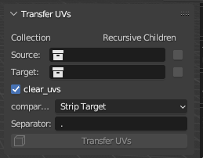

# UV Map Transfer

Simple UI to copy UV Maps between objects with matching naming conventions.

## Contents

1. [Installation](#installation)
2. [Panel layout](#panel-layout)
3. [Options](#options)
4. [Change Log](#change-log)

## Installation

](images/Installation_download.png)

Download latest release.

[Back to Contents](#contents)

## Panel layout

[Back to Contents](#contents)

## Options

[Back to Contents](#contents)

## Change Log

"version": (0, 0, 1)

* Initial upload

[Back to Contents](#contents)
